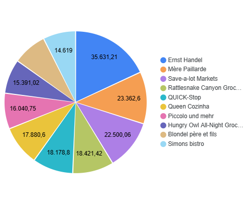
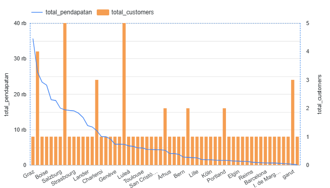

# Customer & Revenue Analysis

## Executive Summary
Analisis ini bertujuan untuk memahami kontribusi pelanggan terhadap pendapatan perusahaan, mengidentifikasi pelanggan VIP, serta melihat peluang strategi **loyalitas**, **upselling**, dan **ekspansi pasar**.

Berdasarkan visualisasi dashboard:
- **Ernst Handel** merupakan pelanggan dengan kontribusi terbesar.
- Kota dengan jumlah pelanggan sedikit belum tentu menghasilkan pendapatan kecil.
- Terdapat kelompok pelanggan yang membeli dari banyak kategori/supplier, yang menunjukkan loyalitas tinggi.

Temuan ini menjadi dasar penting untuk strategi retensi dan optimalisasi penjualan.

---

## Business Objective
Tujuan utama analisis ini adalah:

1. Mengidentifikasi **VIP customer** berdasarkan total pembelian.
2. Mengetahui produk favorit dari top customer untuk strategi **upselling & cross-selling**.
3. Mengelompokkan pelanggan berdasarkan keragaman kategori/supplier.
4. Mengevaluasi performa pendapatan berdasarkan wilayah/kota.

---

## Data Description
Dataset transaksi terdiri dari informasi utama berikut:

- Data pelanggan
- Data pesanan
- Detail produk yang dibeli
- Supplier
- Kategori produk
- Kota asal pelanggan
- Nilai transaksi

Visualisasi dibuat menggunakan **Looker Studio** untuk mempermudah interpretasi bisnis.

---

## Methodology

Pendekatan analisis meliputi:

- Pemeringkatan pelanggan berdasarkan total pembelian
- Identifikasi kontribusi revenue top 10 customer
- Analisis pola belanja pelanggan terbesar
- Perhitungan variasi kategori & supplier yang dibeli
- Perbandingan jumlah pelanggan dan revenue per kota

---

## 1. Analysis & Findings

### VIP Customer Concentration

Diagram pie menunjukkan 10 pelanggan dengan nilai transaksi tertinggi.

Pelanggan dengan kontribusi terbesar adalah:

**Ernst Handel → $35,631.21 (9.2% dari total pendapatan perusahaan).**

Artinya hampir sepersepuluh revenue perusahaan berasal dari satu pelanggan saja.

Ini menunjukkan tingkat ketergantungan yang cukup tinggi terhadap pelanggan utama.

---

### 2. Spending Pattern of Top Customer

Dari peta hierarki pembelian Ernst Handel terlihat urutan produk dari nilai belanja terbesar hingga terkecil.

Produk dengan pengeluaran terbesar adalah:

**Côte de Blaye**

Produk ini dapat dijadikan:
- Anchor product untuk promosi premium  
- Target bundling  
- Referensi rekomendasi produk sejenis dengan harga lebih tinggi

---

### 3. Loyal & Multi-Category Customers

Tabel menunjukkan pelanggan yang membeli dari lebih dari 3 kategori atau supplier berbeda.

Karakteristik segmen ini:
- Tidak terpaku pada satu jenis produk
- Cenderung memiliki repeat order tinggi
- Potensial untuk program membership atau loyalty reward

Mereka adalah kandidat utama untuk:
- Penawaran eksklusif  
- Early access produk baru  
- Diskon berbasis volume

---

### 4. Market Performance per City

Grafik memperlihatkan hubungan antara jumlah pelanggan dan total pendapatan kota.

Temuan penting:

- **Graz** → pelanggan sedikit, tetapi menghasilkan revenue tertinggi ($35,631.21).
- **London** & **Mexico D.F** → pelanggan banyak, tetapi revenue relatif rendah.

Ini berarti:
> Banyak customer ≠ pendapatan tinggi.

Perlu strategi berbeda antara akuisisi dan monetisasi.

---

## Key Insights

- Satu pelanggan dapat menyumbang hampir 10% pendapatan perusahaan.
- Produk premium memainkan peran penting dalam pembentukan revenue.
- Customer multi-kategori adalah indikator loyalitas kuat.
- Beberapa kota memiliki ARPU (Average Revenue per User) tinggi walau jumlah customer rendah.

---

## Business Recommendations

### VIP Retention Strategy
Berikan perlakuan khusus untuk pelanggan seperti Ernst Handel:
- Dedicated account service  
- Diskon eksklusif  
- Prioritas stok produk premium

---

### Upselling & Cross-Selling
Gunakan produk dengan nilai tertinggi sebagai pintu masuk penawaran:
- Bundling produk serupa
- Rekomendasi otomatis produk premium

---

### Loyalty Program untuk Multi-Category Buyers
Buat reward berbasis:
- Jumlah kategori
- Total supplier berbeda
- Volume transaksi

---

### City-Based Strategy
Untuk kota seperti London & Mexico D.F:
- Fokus menaikkan nilai belanja per pelanggan.

Untuk kota seperti Graz:
- Fokus mempertahankan customer bernilai tinggi.

---

## Conclusion
Analisis menunjukkan bahwa:

- Revenue perusahaan sangat dipengaruhi oleh segelintir pelanggan utama.
- Produk premium memberi dampak signifikan terhadap pendapatan.
- Peluang pertumbuhan terbesar ada pada optimalisasi nilai belanja, bukan hanya penambahan jumlah pelanggan.

Dengan strategi retensi VIP, upselling, dan segmentasi pasar berbasis kota, perusahaan dapat meningkatkan profit secara lebih terarah dan efisien.
